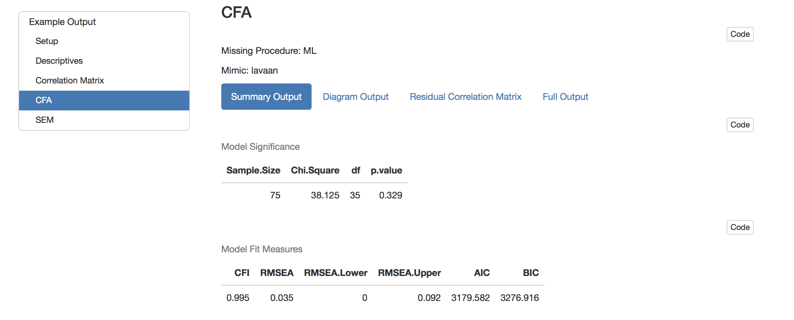
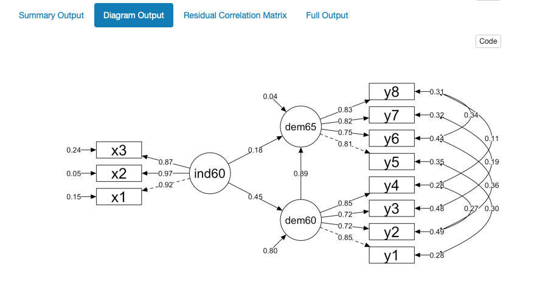

# semoutput 

An R package to create nice looking output for CFA and SEM analyses using lavaan and semPlot packages

Interact with an <a href="http://englelab.gatech.edu/R/ExampleOutput.html" target="_blank">Example Output</a>

## Install

```r
devtools::install_github("dr-JT/semoutput")
```

## Required Packages

* lavaan package to run CFA and SEM analyses

* semPlot package to display model diagrams

* sjPlot package to print correlation tables

## Usage

The package contains an R Markdwon template that makes it very easy to run CFA and SEM analyses in R and create nice looking output.

**Once you install the package, you will be able to access the RMarkdown template by going to**:

File -> New File -> R Markdown... -> From Template -> SEM RMarkdown

You simply need to specify the data file location and the following default model parameters in the YAML header 

```{r}
params:
  import.file: ""       # Relative file path to data
  mimic: "lavaan"       # Which software program to mimic for estimating models
  missing: "ML"         # How to deal with missing values: "ML" or "listwise"
  std.lv: TRUE          # For CFAs, default setting whether to set latent variances to 1 or not
  std.ov: FALSE         # Staandardize all observed varialbes?
  se: "standard"        # How to calcualte standard errors: "standard" or "bootstrap"
  bootstrap: 1000       # If se = "bootstrap" how many boostrap samples?
```
  
Then specify the CFA or SEM model using lavaan syntax. 

lavaan syntax is very intuitive to use and is documented with useful tutorials

http://lavaan.ugent.be/tutorial/index.html

### Example lavaan syntax

CFA

```r
# Specify the model parameters using intuitive syntax to write out equations
model <- '
# latent factors
f1 =~ v1 + v2 + v3
f2 =~ v4 + v5 + v6
f3 =~ v7 + v8 + v9

# correlated errors
v5 ~~ v6
v7 ~~ v8
'

# Run a latent variable analysis
fit <- cfa(model, data = data, missing = "ML", std.lv = FALSE)

```

### Screen Shots

#### Model Fit



#### CFA Output


#### SEM Output


#### Model Diagram



#### Correlation Matrix


